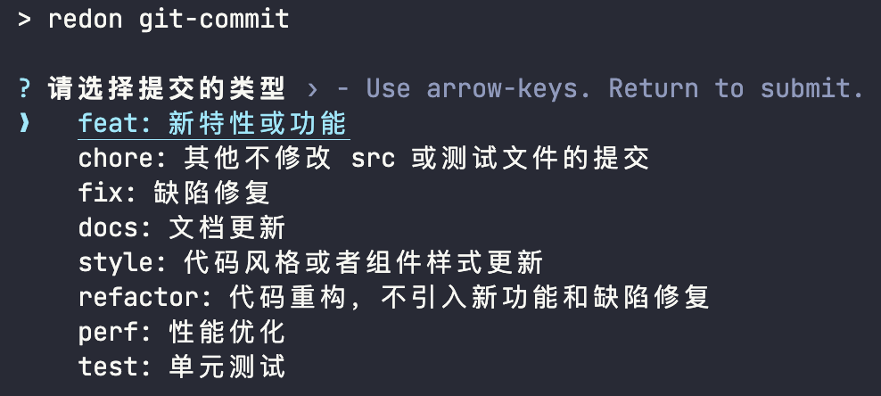

# @redon-web/cli

@redon-web 命令行工具

<br>

```bash
npm i @redon-web/cli -D
```
<a href='https://docs.npmjs.com/cli/v6/commands/npm'>npm</a> · <a href='https://yarnpkg.com'>yarn</a> · <a href='https://pnpm.js.org/en/'>pnpm</a> · <a href='https://bun.sh/'>bun</a>

## `redon` git-commit

命令行 `git commit` 提交工具

```bash
# package.json
"script":{
  "commit": "redon git-commit",
}
```



<br>

## `redon` git-commit-verify

安装 `simple-git-hooks`

```bash
npm install simple-git-hooks -D
```

添加验证钩子

```bash
# package.json
"simple-git-hooks": {
  "commit-msg": "pnpm redon git-commit-verify",
}
```

`commit message` 提交验证，请遵循 [conventional-changelog 标准](https://www.conventionalcommits.org/en/v1.0.0/)

```bash
<类型>[可选 范围]: <描述>

[可选 正文]

[可选 脚注]
```

- feat: 新特性或功能
- chore: 其他不修改 src 或测试文件的提交
- fix: 缺陷修复
- docs: 文档更新
- style: 代码风格或者组件样式更新
- refactor: 代码重构，不引入新功能和缺陷修复
- perf: 性能优化
- test: 单元测试

## `redon` cleanup

删除目录或工作区下所有 `node_modules`、`dist` 和包管理 `lock` 文件（如：`package-lock.json`、`yarn.lock`、`pnpm-lock.yaml`）

```bash
# package.json
"script":{
  "commit": "redon cleanup",
}
```

## `redon` update-pkg

脚本 `ncu --deep -u` 的别名，升级包版本到最新

```bash
# package.json
"script":{
  "update-pkg": "redon update-pkg",
}
```

## `redon` init-git-hooks

初始化 `git` 钩子

```bash
# package.json
"script":{
  "init-git-hooks": "redon init-git-hooks",
}
```

## 帮助

查看帮助命令

```bash
pnpm redon -h
```